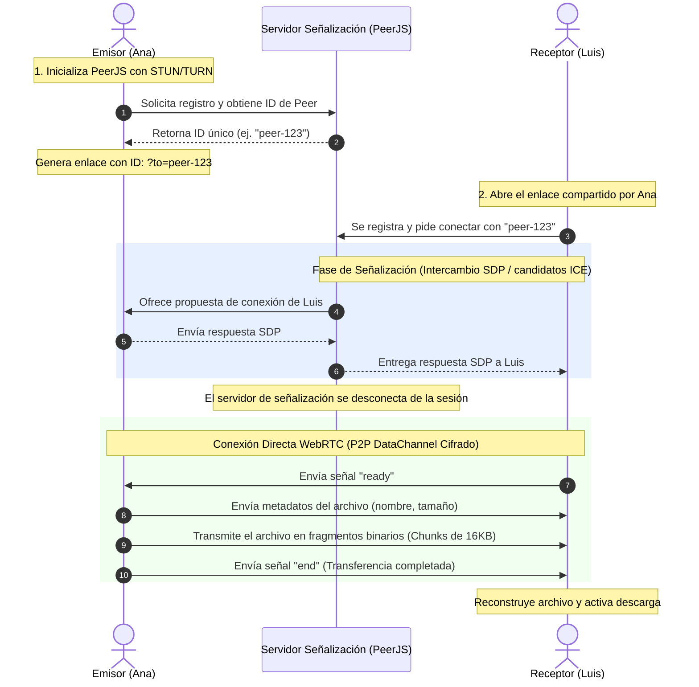

# Arquitectura de Red de ShareFile

ShareFile utiliza un **modelo de red P2P híbrido** para realizar transferencias de archivos ultra-rápidas y seguras. El sistema combina una fase inicial de señalización (signaling) a través de servidores externos con un canal de datos directo (WebRTC DataChannel) para la transferencia real de los archivos.

---

## 🏗️ Esquema de Componentes

La arquitectura se compone de tres entidades principales:

1. **Cliente Emisor (Sender)**: Genera un ID de peer, selecciona el archivo a transferir y espera conexiones entrantes de datos.
2. **Servidor de Señalización (Signaling Server)**: Gestionado por la nube pública de PeerJS. Solo actúa como intermediario inicial para que los dos navegadores intercambien metadatos de red (direcciones IP, candidatos ICE) y se localicen mutuamente. **No tiene visibilidad sobre los archivos**.
3. **Cliente Receptor (Receiver)**: Utiliza el enlace que incluye el ID del emisor (`?to=ID`) para iniciar el proceso de negociación de red y recibir el archivo directamente.

---

## 📊 Diagrama de Flujo de Conexión y Transferencia

El siguiente diagrama ilustra la separación total entre la **fase de señalización** (servidor intermedio) y la **fase de transferencia** (túnel directo P2P):

---

## 🔒 Privacidad y Encriptación

* **Cifrado de Extremo a Extremo (E2EE)**: Todo el tráfico de datos transmitido mediante WebRTC utiliza la especificación estándar **DTLS** (Datagram Transport Layer Security) e **SRTP** (Secure Real-time Transport Protocol). Esto garantiza que el contenido viaje completamente encriptado de navegador a navegador, impidiendo ataques de intermediarios (Man-in-the-Middle), incluso en redes Wi-Fi públicas.
* **Sin Persistencia**: Dado que el canal es 100% directo, ningún trozo del archivo se almacena jamás en un disco intermedio. Al cerrar las pestañas de navegación de los extremos de la conexión, cualquier rastro de la transmisión se borra instantáneamente de la memoria RAM de los dispositivos.
