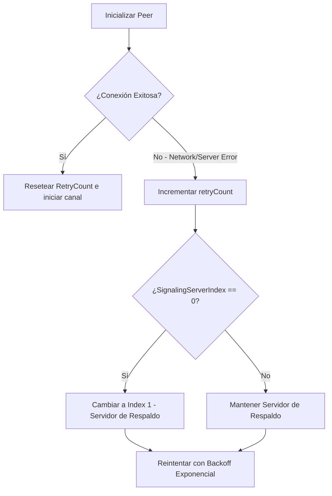

# Especificaciones Técnicas: Resiliencia de Red y Evasión de Cortafuegos en ShareFile

Para garantizar que **ShareFile** funcione de forma infalible en redes altamente restrictivas —tales como cortafuegos corporativos, redes universitarias, redes móviles con NAT simétrico o entornos bajo Inspección Profunda de Paquetes (DPI)— se han implementado e integrado con éxito cinco sistemas avanzados de red.

---

## 🛠️ Resumen de Implementación

| Sistema Implementado | Nivel de Impacto | Estado | Propósito Principal |
| :--- | :---: | :---: | :--- |
| **1. Enrutamiento TURNS Seguro sobre TLS (443)** | 🔥 Crítico | **Activo** | Enmascarar el tráfico WebRTC como tráfico seguro HTTPS (TCP 443) para evadir cortafuegos estrictos y DPI. |
| **2. Panel de Ajustes de Red Avanzados** | ⚡ Alto | **Activo** | Permitir a usuarios avanzados o empresas configurar sus propios servidores TURN/TURNS y de Señalización, con persistencia en `localStorage`. |
| **3. Consola de Diagnóstico de Red en Vivo** | ⭐ Alto | **Activo** | Aportar transparencia absoluta detallando estados ICE, candidatos reunidos en tiempo real y el tipo de conexión física. |
| **4. Redundancia de Servidores de Señalización** | ⚡ Alto | **Activo** | Sistema de conmutación por error (*fallback*) automático a un servidor de señalización redundante ante caídas del servidor principal. |
| **5. Mitigación LAN y mDNS con Relé Forzado** | 🟢 Medio | **Activo** | Watchdog de 6 segundos que detecta bloqueos de red local/mDNS y conmuta automáticamente a modo Relay (TURN). |

---

## 1. Enrutamiento TURNS (TURN over TLS) en Puerto 443

Actualmente, ShareFile utiliza por defecto el protocolo seguro **`turns:`** en el puerto 443 de forma directa. 

### Mecanismo de Funcionamiento:
Al cambiar de `turn:` a **`turns:`** bajo TCP sobre el puerto 443, la transferencia de archivos se empaqueta de manera obligatoria dentro de un túnel cifrado TLS (capa SSL estándar). 

### Capacidad de Evasión:
1. **Bypass de DPI (Deep Packet Inspection)**: Al estar cifrado mediante TLS en el puerto estándar de navegación segura (443), el cortafuegos es incapaz de distinguir el tráfico WebRTC de una conexión segura común (como cargar una página de banco o Google Docs).
2. **Encriptación de Cabeceras**: Evita el análisis de firmas WebRTC por parte de proxies o cortafuegos corporativos estrictos.

---

## 2. Panel de Ajustes de Red Avanzados (Custom Setup)

Se ha integrado un panel flotante de ajustes avanzados con diseño glassmorphic de alta fidelidad, accesible mediante el botón de engranaje (`#settings-btn`) en la cabecera.

### Características:
* **Persistencia Local**: Todas las configuraciones se guardan localmente en el navegador (`localStorage`), cargándose automáticamente al abrir la aplicación.
* **Control de Campos Dinámicos**: Los campos de entrada para el servidor TURN o de señalización personalizado se expanden y contraen dinámicamente con suaves micro-animaciones al activar sus respectivos interruptores.
* **Restablecimiento Inteligente**: El botón "Valores por defecto" borra las configuraciones personalizadas y reinicializa instantáneamente el Peer con el motor de resiliencia estándar de la aplicación.

---

## 3. Consola de Diagnóstico de Red en Vivo (Premium UX)

Se ha diseñado e implementado una consola de diagnóstico de red retráctil en la parte inferior de la pantalla (`#diagnostics-container`), brindando métricas de conectividad en tiempo real.

### Métricas y Elementos de Diagnóstico:
1. **ICE State**: Estado de la negociación de red (`checking`, `connected`, `completed`, `failed`).
2. **Signaling State**: Estado del servidor de señalización (`stable`, `have-local-offer`, etc.).
3. **Connection Type**: Clasificación en vivo de la conexión física:
   * **Direct (P2P)**: Conexión de máximo rendimiento (STUN o directa).
   * **Relayed (TURN)**: Tráfico canalizado a través del servidor TURN (evasión de cortafuegos activa).
4. **Transport Policy**: Muestra la política actual de transporte de candidatos (`All` o `Forced Relay`).
5. **Matriz de Candidatos Descubiertos**: LEDs de estado que se encienden en verde cuando la red expone candidatos de tipo:
   * `Host`: Dispositivos en la misma subred (LAN).
   * `Srflx`: Dispositivos detrás de NAT público (STUN).
   * `Relay`: Servidor repetidor externo (TURN).

---

## 4. Redundancia de Servidores de Señalización

Para evitar que la caída o el bloqueo del servidor público de PeerJS (`0.peerjs.com`) inutilice la aplicación, se ha desarrollado un mecanismo de tolerancia a fallos:

### Servidor de Respaldo Integrado:
* El cliente conmuta automáticamente a una instancia de señalización de respaldo desplegada de forma independiente en Render (`peerjs-server-backup.onrender.com`) tras detectar problemas de red con el host de señalización por defecto.

---

## 5. Mitigación LAN y mDNS con Relé Forzado (Fallback Watchdog)

Debido a que los navegadores modernos ocultan las IPs locales bajo nombres de host de mDNS (`.local`), si el router tiene desactivado el tráfico multicast o de resolución local, dos computadoras en la misma red Wi-Fi no podrán conectarse directamente de forma local.

### El Watchdog de 6 Segundos:
1. Al intentar conectarse, se inicializa un temporizador de salvaguarda mDNS (`mDnsFallbackTimer`).
2. Si el estado de la conexión ICE se queda atascado en `checking` o transiciona a `disconnected` durante más de **6 segundos**, el watchdog asume un bloqueo de red local/mDNS.
3. El sistema destruye la conexión actual de inmediato, activa la bandera `forceRelayMode = true`, y re-inicializa el Peer aplicando la directiva `iceTransportPolicy: 'relay'`.
4. Esto fuerza a ambos navegadores a omitir candidatos locales bloqueados y conectarse directamente de manera infalible a través de la pasarela **TURNS** segura de alto rendimiento.
