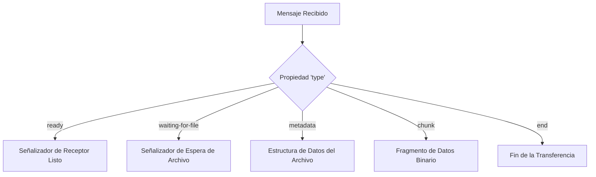

# Interfaces y Protocolo de Comunicación

Este documento define la estructura de los datos intercambiados entre los extremos (Emisor y Receptor) a través del canal de datos seguro (`DataChannel`) de PeerJS, asegurando la consistencia y compatibilidad del protocolo.

---

## 📨 1. Protocolo de Mensajes (Mensajería de Aplicación)

Las dos instancias de ShareFile se comunican intercambiando objetos JSON y fragmentos de datos binarios planos. Todos los mensajes tienen una propiedad común `type` que determina su estructura y función:



### Mensaje: `ready`
* **Emisor**: Receptor -> Emisor.
* **Propósito**: Informa al Emisor de que el canal de datos del Receptor se ha abierto con éxito y está completamente listo para recibir metadatos o chunks.
* **Estructura**:
  ```json
  { "type": "ready" }
  ```

### Mensaje: `waiting-for-file`
* **Emisor**: Emisor -> Receptor.
* **Propósito**: Si el emisor ha abierto el canal con el receptor pero aún **no ha elegido un archivo** para enviar, envía esta señal para actualizar la interfaz del receptor y mostrarle que la conexión es correcta pero falta seleccionar el archivo.
* **Estructura**:
  ```json
  { "type": "waiting-for-file" }
  ```

### Mensaje: `metadata`
* **Emisor**: Emisor -> Receptor.
* **Propósito**: Envía la información básica del archivo que va a ser transferido a continuación para que el receptor prepare el búfer y configure la barra de progreso en su pantalla.
* **Estructura**:
  ```json
  {
    "type": "metadata",
    "name": "nombre_del_archivo.ext",
    "size": 1548234,
    "fileType": "application/pdf"
  }
  ```

### Mensaje: `chunk`
* **Emisor**: Emisor -> Receptor.
* **Propósito**: Contiene los datos puros binarios fragmentados del archivo.
* **Estructura**:
  * En PeerJS, cuando se envía un fragmento, se transmite un objeto con dos claves: `type: 'chunk'` y `data` (que contiene el `ArrayBuffer` binario enviado por el emisor).
  ```json
  {
    "type": "chunk",
    "data": ArrayBuffer
  }
  ```

### Mensaje: `end`
* **Emisor**: Emisor -> Receptor.
* **Propósito**: Señala al receptor que se ha completado la transmisión del archivo actual, permitiéndole unir el búfer y generar el botón de descarga en la UI.
* **Estructura**:
  ```json
  { "type": "end" }
  ```

---

## 🚦 2. Estados de Conexión de la Interfaz (UI Status Badge)

El indicador de conexión `#connection-status` en el encabezado se actualiza de forma reactiva con los siguientes estados visuales en CSS (`style.css`):

| Estado CSS | Color de la Insignia | Texto ES | Texto EN | Condición de Activación |
|------------|-----------------------|----------|----------|-------------------------|
| `.disconnected` | Rojo | "Desconectado. Reintentando..." | "Disconnected. Retrying..." | El peer no puede alcanzar el servidor de señalización, o el canal de datos se ha caído. |
| `.connecting` | Naranja / Amarillo | "Conectando a la red..." | "Connecting to network..." | Fase inicial de registro en el servidor de señalización o intento de enlace SDP. |
| `.connected` | Verde | "Conectado" | "Connected" | El canal de datos directa WebRTC está establecido y listo. |
